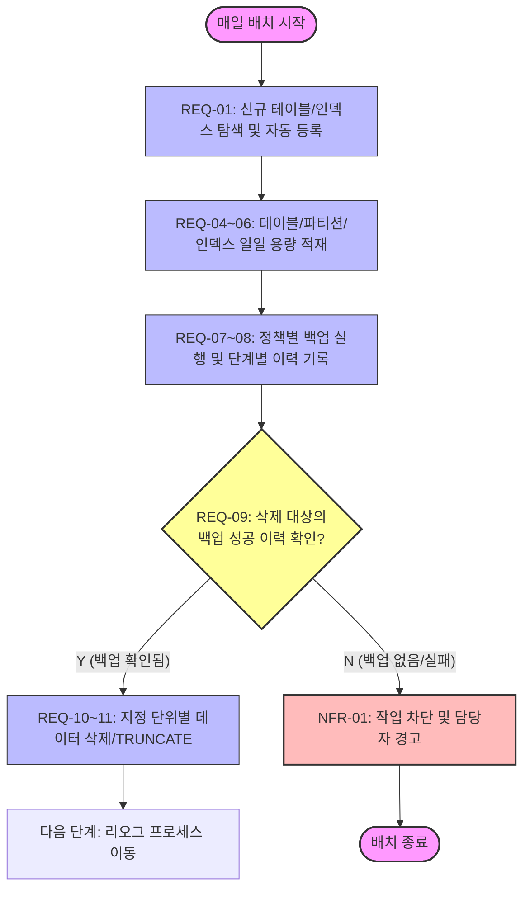
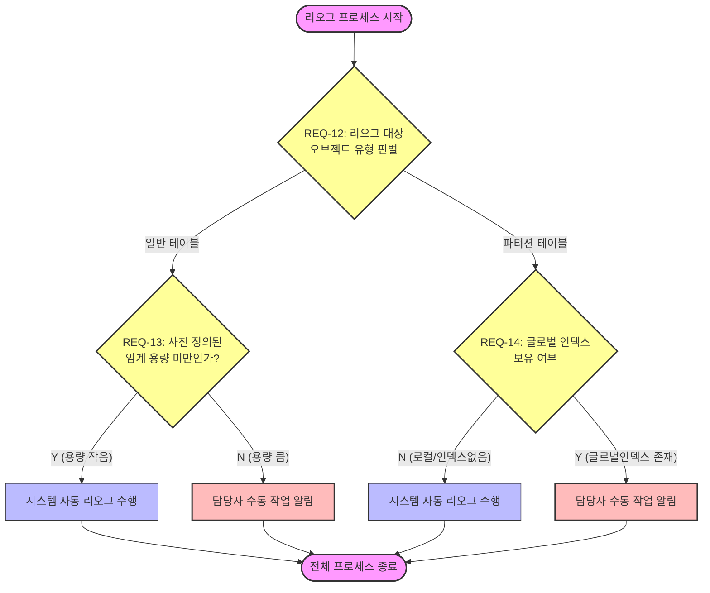

# [요구사항정의서] 데이터 생명주기 관리(DLM) 시스템

## 1. 시스템 목적 및 범위

본 시스템은 데이터베이스 내 산재한 스키마와 테이블의 생명주기(등록, 용량 모니터링, 백업, 삭제, 최적화)를 자동화된 규칙에 따라 안전하게 관리하고 제어하는 것을 목적으로 한다.

---

## 2. 시스템 프로세스 흐름도 (Mermaid)

### 2.1 일일 데이터 수집 및 백업/삭제 검증 흐름

### 2.2 리오그(Reorg) 대상 판단 및 자동/수동 분기 흐름

---

## 3. 기능 요구사항 (Functional Requirements)

### 3.1 메타데이터 및 대상 자동 관리

* **REQ-01: 신규 오브젝트 자동 탐색 및 관리**
* 시스템은 대상 데이터베이스 내에 새롭게 생성된 스키마, 테이블, 인덱스를 자동으로 감지하여 관리 대상 마스터에 등록해야 한다. (요건 1, 14)

* **REQ-02: 파티션 정보 식별**
* 시스템은 관리 대상 테이블의 파티션 여부를 판별하고, 파티션 테이블인 경우 세부 파티션 목록 정보를 상시 추적·보유해야 한다. (요건 2)

* **REQ-03: 정책 통제 권한 부여**
* 시스템은 각 테이블 및 세부 파티션 단위별로 '백업 가능 여부'와 '데이터 삭제 가능 여부'를 개별 제어할 수 있는 정책 플래그를 제공해야 한다. (요건 3, 6)

### 3.2 일일 데이터 용량 및 상태 수집

* **REQ-04: 일 단위 테이블 용량 통계 적재**
* 시스템은 현황 파악을 위해 매일 전체 관리 대상 테이블의 물리 용량을 수집하고 이력 데이터로 적재해야 한다. (요건 15)

* **REQ-05: 파티션 단위 용량 통계 적재**
* 파티션 테이블의 경우, 테이블 전체 용량뿐만 아니라 개별 파티션별 상세 물리 용량을 분리하여 매일 수집·적재해야 한다. (요건 16, 18)

* **REQ-06: 인덱스 단위 용량 통계 적재**
* 시스템은 테이블 및 파티션 용량 수집 시점과 동일하게, 연관된 모든 인덱스의 용량 정보도 매일 수집하여 이력화해야 한다. (요건 17)

### 3.3 데이터 백업 및 진행 상태 추적

* **REQ-07: 다중 백업 주기 지원**
* 시스템은 운영 정책 및 데이터 특성에 맞추어 일단위, 월단위, 년단위 및 전체(Full) 단위의 백업 실행 방식을 모두 지원해야 한다. (요건 5)

* **REQ-08: 백업 처리 단계 및 이력 추적**
* 시스템은 백업 작업 진행 시 현재 어느 단계까지 처리가 완료되었는지, 어디까지 진행 중인지를 실시간으로 기록하고 추적할 수 있는 진행 이력 관리 기능을 갖추어야 한다. (요건 4)

### 3.4 데이터 삭제 및 무결성 검증

* **REQ-09: 삭제 전 백업 여부 교차 검증 절차**
* 시스템은 데이터 삭제 요청을 처리하기 전, 대상 데이터의 백업 완료 상태를 필수로 확인하는 통제 검증 절차를 거쳐야 한다. 마스터 정책상 백업 여부가 'Y'로 설정된 대상은 백업이 완벽히 성공한 이력이 확인된 경우에만 삭제 작업을 착수할 수 있다. (요건 7)

* **REQ-10: 다중 삭제 방식 및 범위 지원**
* 데이터 삭제 작업은 일단위, 월단위, 년단위 단위를 지원해야 하며, 테이블 전체 삭제 요청 시에는 `TRUNCATE` 처리를 지원해야 한다. (요건 8)

* **REQ-11: 파티션 단위 독립 삭제**
* 파티션 테이블의 경우 전체 데이터 영역에 영향을 주지 않고, 특정 파티션 영역만 지정하여 독립적으로 데이터를 삭제(Drop/Truncate Partition)할 수 있어야 한다. (요건 9)

### 3.5 리오그(Reorg) 대상 판단 및 작업 분기

* **REQ-12: 오브젝트 유형별 리오그 대상 분석**
* 수집된 일별 용량 정보 및 파편화 상태를 분석하여 일반 테이블과 파티션 테이블을 명확히 분리하여 리오그 대상을 판단해야 한다. (요건 10, 11)

* **REQ-13: 일반 테이블 - 용량 기준 자동/수동 작업 분기**
* 일반 테이블이 리오그 대상으로 판단되었을 때, 사전 정의된 특정 용량(임계치) 미만인 경우는 시스템이 '자동 리오그'를 수행하고, 임계치 이상인 경우는 위험도를 고려하여 시스템이 작업을 멈추고 '담당자 수동 작업 알림'으로 분기해야 한다. (요건 11)

* **REQ-14: 파티션 테이블 - 글로벌 인덱스 기준 자동/수동 작업 분기**
* 파티션 테이블이 리오그 대상으로 판단되었을 때, 연관된 글로벌 인덱스(Global Index) 보유 여부를 확인해야 한다. 글로벌 인덱스가 존재하면 '담당자 수동 작업 알림'으로 분기하고, 로컬 인덱스만 있거나 인덱스가 없는 경우에는 시스템이 '자동 리오그'를 수행해야 한다. (요건 12, 13)

---

## 4. 비기능 요구사항 (Non-Functional Requirements)

* **NFR-01: 데이터 정밀성 및 정합성**
* 삭제 전 백업 검증 단계(REQ-09)에서 상태 값이 불명확하거나 에러가 발생한 경우, 안전을 위해 데이터 무결성을 최우선으로 하여 후속 프로세스는 '즉시 차단 및 경고' 상태로 전환되어야 한다.

* **NFR-02: 자원 최적화 (싱글 시스템 제약)**
* 시스템은 단일 노드(싱글 시스템) 환경에서 구동되므로 대용량 삭제 및 리오그 작업 시 발생하는 Disk I/O 병목을 방지하기 위해 동시 작업 실행 수를 제한하는 제어 메커니즘을 가져야 한다.

* **NFR-03: 대상 데이터베이스 및 접속 라이브러리 제약**
* 시스템은 **Oracle Database 12c Exadata (엑사디비)** 환경에서 동작해야 한다.
* 모든 데이터베이스 연결 및 쿼리 처리는 프로젝트 공통 디렉토리에 정의된 [lf_database.py](file:///Users/final97/workdir/vibe_coding_db_management/common/lf_database.py) 모듈의 `Database` 클래스를 활용해 트랜잭션 및 리소스 생명주기를 제어해야 한다.
* 시스템 메타데이터 및 배치 이력 정보도 대상 오라클 스키마 내에 테이블을 구성하여 관리한다.

* **NFR-04: 배치 수행 환경 제약 (Airflow)**
* 개발된 DLM 배치 시스템은 **Apache Airflow 2.2.4** 환경 하에서 기동되고 스케줄링되어야 한다.
* 따라서 Airflow PythonOperator 또는 DAG 연동 구조와 완벽히 호환되도록 설계되어야 한다.

